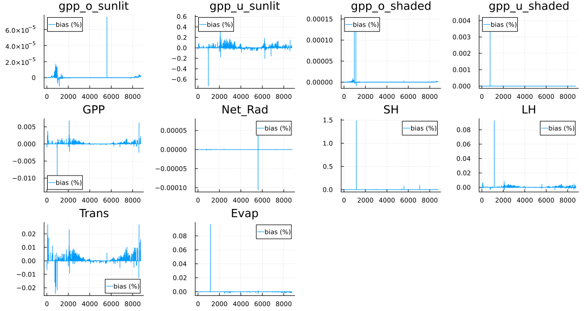
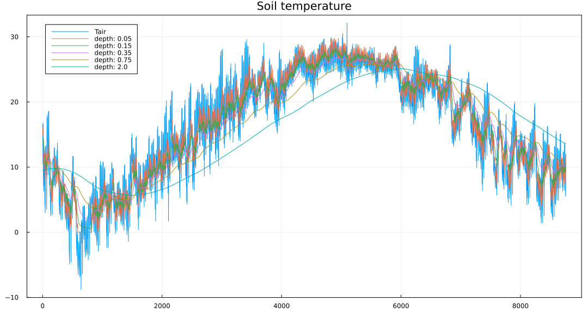
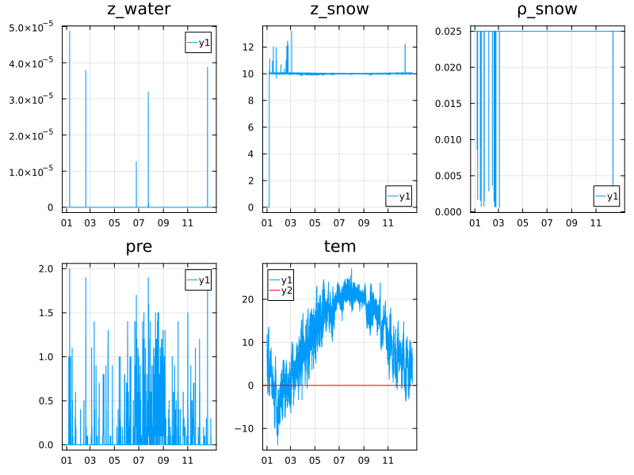
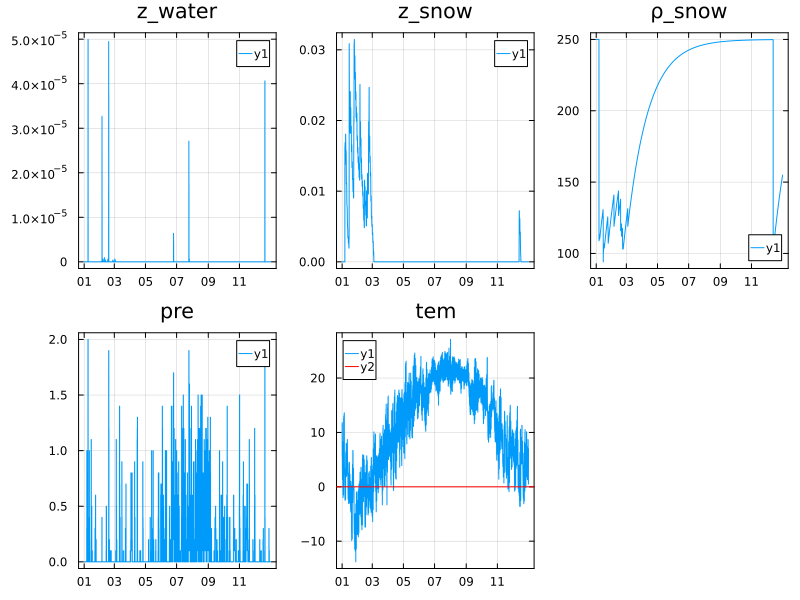

# BEPS.jl

[](https://jl-pkgs.github.io/BEPS.jl/dev)
[](https://github.com/jl-pkgs/BEPS.jl/actions/workflows/CI.yml)
[](https://app.codecov.io/gh/jl-pkgs/BEPS.jl/tree/master)

Boreal Ecosystem Productivity Simulator in Julia

> Dongdong Kong
>
> BEPS.jl is alive in Julia now. All functions have been ported to Julia, and the
> performance is about 2.5 times faster than C version.
>
> - Julia: 0.286327 seconds (822.38 k allocations: 22.998 MiB, 0.85% gc time)
> - C    : 0.787059 seconds (629.95 k allocations: 13.915 MiB)

> [!CAUTION]
> `BEPS.clang` only works under Windows.

## Install

- For developers

  ```bash
  git clone https://github.com/jl-pkgs/BEPS.jl
  cd BEPS.jl/deps
  git clone https://github.com/jl-pkgs/BEPS.c
  ```

- For users

  ```bash
  # In Julia
  ] add https://github.com/jl-pkgs/BEPS.jl
  ```

## Usage

```julia
using BEPS
d = deserialize("data/p1_meteo")
lai = readdlm("examples/input/p1_lai.txt")[:]

par = (lon=120.5, lat=30.5, landcover=25, clumping=0.85,
  soil_type=8, Tsoil=2.2,
  soilwater=0.4115, snowdepth=0.0)

@time df_jl, df_ET_jl, Tg = besp_main(d, lai, par; version="julia");
```

> Figure1: The bias of Julia version compared with C, `bias = (Julia - C)/ C`.


The bias of `SH` is the largest due to double number accuracy, about 1.48%, which is acceptable.

> Figure2: The variation of soil temperature at different depths.


See [examples/example_01.qmd](examples/example_01.qmd) for details.

## TODO

- [ ] 通量站上测试模型表现 (top1 task)
- [ ] 热浪期间，土壤温度的表现
- [ ] 土壤类型参数
- [ ] clumping index数据处理

## Bugs Fixed

### 2024-10-13

- [x] `LAMBDA` function in the `photosynthesis` module, the unit of `lambda_ice`
  is error, `333 J/kg` should be `333000 J/kg`.

- [x] snowpack_stage1:
  + `snowrate_o`未被初始化，导致`snowrate_o > 0`为`true`.
  + 雪深最大设置为`10m`，防止不合理的不断累积：`*depth_snow=min(*mass_snow_g/(*density_snow), 10.0);`
- [x] snowpack_stage3: 
  `max(mass_water_frozen,*depth_water*density_water)`, `max` should be `min`

### 2024-10-14

- [x] snowpack: 积雪夏季不融化，`z_snow`不断增加，一直到无穷

  + `snowpack_stage3_jl`融雪和结冻条件的改正：
  ```julia
  # con_melt = Tsnow > 0 && Tsnow_last <= 0 && ms_sup > 0
  # con_frozen = Tsnow <= 0 && Tsnow_last > 0 && z_water > 0
  con_melt = Tsnow > 0 && ms_sup > 0
  con_frozen = Tsnow <= 0 && z_water > 0
  ```
  + `ρ_snow`: 初始值设置为`250 [kg m-3]`，避免在`0`处跳动。
  + `z_snow`: 积雪深度，最大限制在`10m`
  + `ρ_snow`: 传入状态变量state，前后沿用
  > 修复前的结果
  

  > 修复后的结果
  

  详细代码见：[Figure3_snowpack_diagnose.jl](examples/Figure3_snowpack_diagnose.jl)

### 2025-10-25
  - [ ] 植被光合中的叶片温度 传入参数有误，待修正

## Researches

<!-- - [ ] 研究土壤温度和空气温度之间的关系，为sentinel-2遥感数据反演提供依据
- [ ] 光周期影响测试 -->

## References

1. Hourly BEPS model. <https://github.com/JChen-UToronto/BEPS_hourly_site>

2. Daily BEPS model developed by Jane Liu. <https://github.com/JChen-UToronto/BEPS_D>

3. 统一C与Julia接口，<https://github.com/CUG-hydro/BEPS.c>
