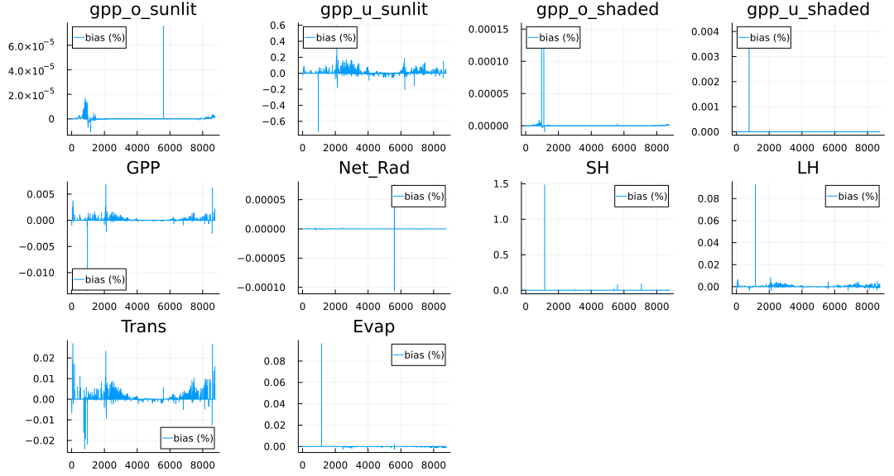
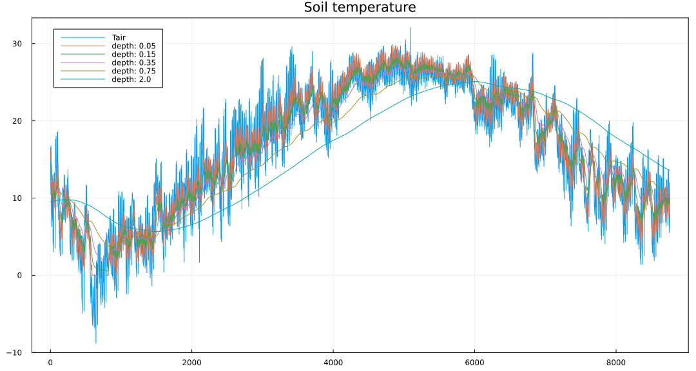
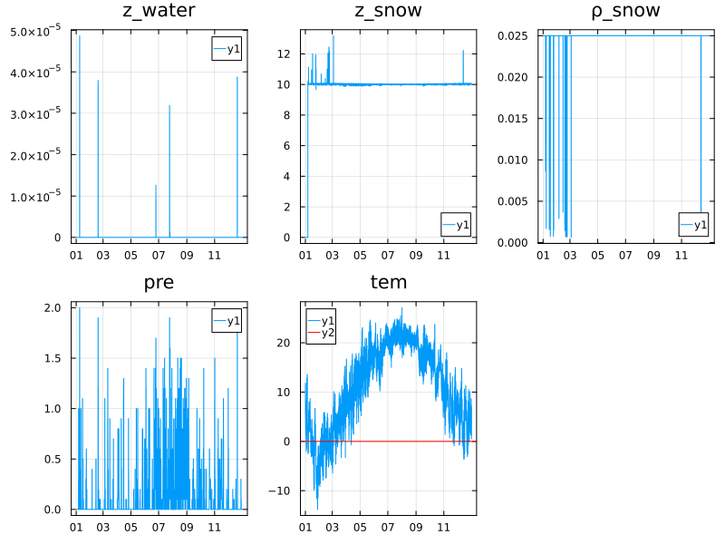
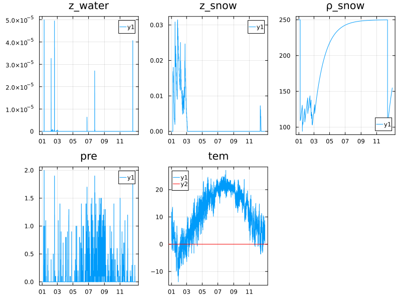

# BEPS.jl

[](https://jl-pkgs.github.io/ModernBEPS.jl/dev)
[](https://github.com/jl-pkgs/ModernBEPS.jl/actions/workflows/CI.yml)
[](https://app.codecov.io/gh/jl-pkgs/ModernBEPS.jl/tree/master)

Boreal Ecosystem Productivity Simulator in Julia

> Dongdong Kong
>
> BEPS.jl is alive in Julia now. All functions have been ported to Julia, and the
> performance is about 4.3 times faster than C version (v2026.05.03, Ultra7 155H CPU).
>
> - Julia: 0.133081 seconds (605.51 k allocations: 27.008 MiB, 2.42% compilation time)
> - C    : 0.570192 seconds (15.17 k allocations: 9.531 MiB, 3.52% gc time)

> `BEPS.clang` works for Windows, Linux and Mac (v2026.05.02).

## Install

- For users

  ```bash
  # In Julia
  ] add https://github.com/jl-pkgs/ModernBEPS.jl
  ```

- For developers

  ```bash
  git clone https://github.com/jl-pkgs/ModernBEPS.jl
  # cd BEPS.jl/deps
  # git clone https://github.com/jl-pkgs/BEPS.c
  ```

## Usage

```julia
using BEPS
d = deserialize("data/p1_meteo")
lai = readdlm("examples/input/p1_lai.txt")[:]

par = (lon=120.5, lat=30.5, landcover=25, clumping=0.85,
  soil_type=8, Tsoil=2.2,
  soilwater=0.4115, snowdepth=0.0)

@time df_jl, df_ET_jl, Tg = beps_main(d, lai, par; version="julia");
```

> Figure1: The bias of Julia version compared with C, `bias = (Julia - C)/ C`.


The bias of `SH` is the largest due to double number accuracy, about 1.48%, which is acceptable.

> Figure2: The variation of soil temperature at different depths.


See [examples/example_01.qmd](examples/example_01.qmd) for details.

## Params现代化管理（自动加载、自动优化）

```julia
# 水力参数
@bounds @with_kw mutable struct ParamSoilHydraulic{FT<:AbstractFloat}
  θ_vfc::FT = FT(0.30) | (0.10, 0.45)   # volumetric field capacity [-]
  θ_vwp::FT = FT(0.10) | (0.02, 0.30)   # volumetric wilting point [-]
  θ_sat::FT = FT(0.45) | (0.25, 0.70)   # volumetric saturation [-]

  K_sat::FT = FT(5.0) | (0.01, 50.0)   # saturated hydraulic conductivity [cm h-1]

  ψ_sat::FT = FT(-0.5) | (-2.0, -0.01)  # matric potential at saturation [m]
  b::FT = FT(5.0) | (1.5, 15.0)    # Campbell parameter [-]
end

# 热力参数
@bounds @with_kw mutable struct ParamSoilThermal{FT<:AbstractFloat}
  κ_dry::FT = FT(0.2) | (0.05, 0.5)      # dry soil thermal conductivity [W m-1 K-1]
  ρ_soil::FT = FT(1300.0) | (800.0, 1800.0) # soil bulk density [kg m-3]
  V_SOM::FT = FT(0.02) | (0.0, 0.3)      # organic matter volume fraction [-]
end

@bounds @with_kw mutable struct ParamVeg{FT<:AbstractFloat}
  # lc::Int = 1
  # Ω0::FT = 0.7             # // clumping_index
  has_understory::Bool = true      # 
  is_bforest::Bool = false         # broadleaf forest

  LAI_max_o::FT = 4.5 | (0.1, 7.0)      # LAI max for overstory
  LAI_max_u::FT = 2.4 | (0.1, 7.0)      # LAI max for understory

  α_canopy_vis::FT = 0.055 | (0.02, 0.15)  # canopy albedo visible
  α_canopy_nir::FT = 0.300 | (0.15, 0.50)  # canopy albedo near-infrared
  α_soil_sat::FT = 0.10 | (0.05, 0.20)     # albedo of saturated soil
  α_soil_dry::FT = 0.35 | (0.20, 0.50)     # albedo of dry soil

  # r_drainage::FT = 0.5     # ? 产流比例
  r_root_decay::FT = Cdouble(0.95) | (0.85, 0.999) # ? 根系分布衰减率, decay_rate_of_root_distribution

  z_canopy_o::FT = 1.0 | (0.1, 50.0)    # overstory canopy height [m]
  z_canopy_u::FT = 0.2 | (0.05, 5.0)    # understory canopy height [m]
  z_wind::FT = 2 | (1.0, 100.0)         # wind measurement height [m]

  g1_w::FT = 8 | (1.0, 20.0)            # Ball-Berry slope coefficient
  g0_w::FT = 0.0175 | (0.001, 0.1)      # Ball-Berry intercept for H2O

  VCmax25::FT = 89.45 | (5.0, 200.0)    # max Rubisco capacity at 25℃ [μmol m-2 s-1], global range
  # Jmax25::FT = 2.39 * 57.7 - 14.2 #

  # # coefficient reflecting the sensitivity of stomata to VPD/moderately N-stressed plants
  N_leaf::FT = 1.74 + 0.71 | (0.5, 5.0)   # leaf Nitrogen content, mean value + 1 SD [g/m2]
  slope_Vc::FT = 33.79 / 57.7 | (0.3, 1.0) # slope for Vcmax-N relationship
end

@bounds @with_kw_noshow mutable struct ParamBEPS{FT<:AbstractFloat}
  N::Int = 5
  dz::Vector{FT} = FT[0.05, 0.10, 0.20, 0.40, 1.25]  # 土壤层厚度 [m], BEPS V2023
  r_drainage::FT = Cdouble(0.50) | (0.2, 0.7)  # ? 地表排水速率（地表汇流），可考虑采用曼宁公式

  ψ_min::FT = Cdouble(33.0)  # [m], about 0.10~0.33 MPa开始胁迫点
  alpha::FT = Cdouble(0.4)   # [-], 土壤水限制因子参数，He 2017 JGR-B, Eq. 4

  hydraulic::ParamSoilHydraulicLayers{FT} = ParamSoilHydraulicLayers{FT,N}()
  thermal::ParamSoilThermalLayers{FT} = ParamSoilThermalLayers{FT,N}()

  veg::ParamVeg{FT} = ParamVeg{FT}()
end
```


## TODO

- [ ] 通量站上测试模型表现 (top1 task)
- [ ] 热浪期间，土壤温度的表现
- [ ] 土壤类型参数
- [ ] clumping index数据处理

## Bugs Fixed

### 2024-10-13

- [x] `LAMBDA` function in the `photosynthesis` module, the unit of `lambda_ice`
  is error, `333 J/kg` should be `333000 J/kg`.

- [x] snowpack_stage1:
  + `snowrate_o`未被初始化，导致`snowrate_o > 0`为`true`.
  + 雪深最大设置为`10m`，防止不合理的不断累积：`*depth_snow=min(*mass_snow_g/(*density_snow), 10.0);`
- [x] snowpack_stage3: 
  `max(mass_water_frozen,*depth_water*density_water)`, `max` should be `min`

### 2024-10-14

- [x] snowpack: 积雪夏季不融化，`z_snow`不断增加，一直到无穷

  + `snowpack_stage3_jl`融雪和结冻条件的改正：
  ```julia
  # con_melt = Tsnow > 0 && Tsnow_last <= 0 && ms_sup > 0
  # con_frozen = Tsnow <= 0 && Tsnow_last > 0 && z_water > 0
  con_melt = Tsnow > 0 && ms_sup > 0
  con_frozen = Tsnow <= 0 && z_water > 0
  ```
  + `ρ_snow`: 初始值设置为`250 [kg m-3]`，避免在`0`处跳动。
  + `z_snow`: 积雪深度，最大限制在`10m`
  + `ρ_snow`: 传入状态变量state，前后沿用
  > 修复前的结果
  

  > 修复后的结果
  

  详细代码见：[Figure3_snowpack_diagnose.jl](examples/Figure3_snowpack_diagnose.jl)

### 2025-10-25
  - [ ] 植被光合中的叶片温度 传入参数有误，待修正

### 2026-01-14

  - [x] `surface_temperature_jl`中`T_weighted`求解公式错误，分子第二项漏写了`z_snow`，推导过程见：<docs/modules/TS_Case02.md>。
  - [x] `surface_temperature_jl`中case02 `G_soil`
    ```julia
    G_soil = G_snow * (T_soil_surf - T_soil1_last) / z_soil1   # wrong
    G_soil = κ_soil1 * (T_soil_surf - T_soil1_last) / Δz_soil1 # correct
    ```

### 2026-05-02
  - [x] `inter_prg`中`UpdateHeatFlux(state, _Ta_annual, kstep)`，第二参数应传入Ta_annual而非Tair，对G会引起较大误差。
  - [x] `Init_Soil_Parameters`中`V_SOM`值域在[0, 1]，而非0-100。

## Researches

<!-- - [ ] 研究土壤温度和空气温度之间的关系，为sentinel-2遥感数据反演提供依据
- [ ] 光周期影响测试 -->

## References

1. Hourly BEPS model. <https://github.com/JChen-UToronto/BEPS_hourly_site>

2. Daily BEPS model developed by Jane Liu. <https://github.com/JChen-UToronto/BEPS_D>

3. 统一C与Julia接口，<https://github.com/CUG-hydro/BEPS.c>
